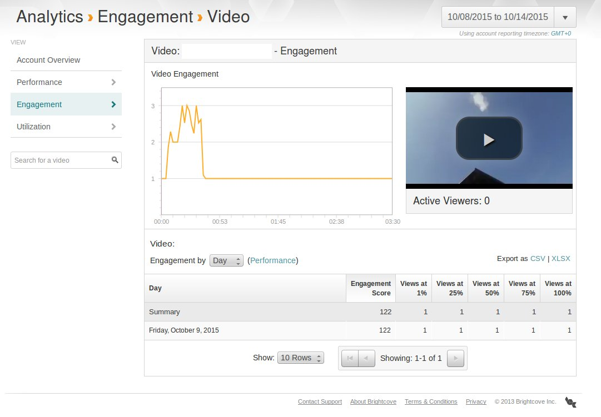

# videojs BrightCove tracking

BrightCove plugin for video.js

## Getting Started
Download [videojs](http://www.videojs.com/) and [videojs.brightcove tracking](https://github.com/space87/videojs-BrightCove-tracking)

On your page include the plugin file.
```html
<script src="dist/videoTracking.min.js"></script>
```
-Please note that the **videojs.js** file and **jquery** needs to be loaded prior to this plugin

-Also this can only be used if you call videojs dynamically

You Call the plugin like this :

```javascript

videojs('video-offre', {
    'controls': true,
    'preload': 'auto',
    'autoplay': false,
    'plugins': {
        brightCoveAnalytics: {
            accountID: 'Your brightcove accound id',
            video: {
                id: 'id of your brightcove video',
                name: 'name of your video'
            }
        }
    }
}, function () {
    // You must declare your source
    this.src('example.mp4');
});

```

## Options

You need provide to provide it with your BrightCove Id in the accountID value.

Also to allow BrightCove to see what video it is tracking you need to put in the video name and id.

## Tracked events
Currently this plugin will track:

* video_impression
* video_view
* video_engagement : reports every 5 seconds by default, allowing the collection of engagement data. 
You can change this behavior with the setting secondsViewInterval. The minimum is 5, and the maximum is 20 (otherwise it will be discarded by the brightcove analytics system)

You can then see your stats on the videocloud interface, in the analytics section (it takes about 15 minutes for the hits sent to be processed by the brightcove analytics system)



**The event player_load is not tracked, since you are not using a player from the BrightCove videocloud (which have a playerID), but videojs instead**

## Events api overview (from Brightcove) : 

http://docs.brightcove.com/en/video-cloud/analytics-api/getting-started/data-collection-api-overview.html
